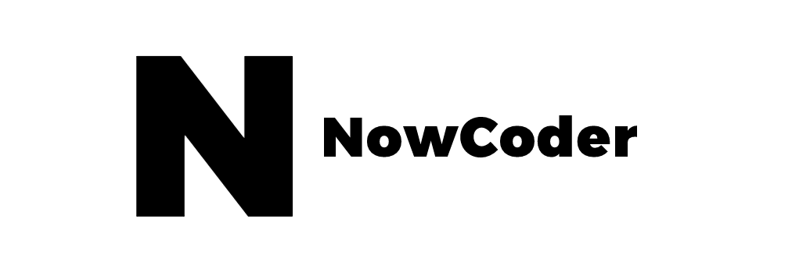

<!-- PROJECT LOGO -->
<br />
<div align="center">
  <a href="https://github.com/kalebkwok/NowCoderBlog">
    
  </a>

  <h3 align="center">NowCoder Blog</h3>

  <p align="center">
   A Web blog you can share your comments,
    <br />
    <br />
    <br />
    <a href="https://github.com/kalebkwok/NowCoderBlog/issues">Report Bug</a>
    ·
    <a href="https://github.com/kalebkwok/NowCoderBlog/issues">Request Feature</a>
  </p>
</div>


<!-- TABLE OF CONTENTS -->
<details>
  <summary>Table of Contents</summary>
  <ol>
    <li>
      <a href="#about-the-project">About The Project</a>
      <ul>
        <li><a href="#built-with">Built With</a></li>
      </ul>
    </li>
    <li>
      <a href="#getting-started">Getting Started</a>
      <ul>
        <li><a href="#prerequisites">Prerequisites</a></li>
        <li><a href="#installation">Installation</a></li>
      </ul>
    </li>
    <li><a href="#usage">Usage</a></li>
    <li><a href="#roadmap">Roadmap</a></li>
    <li><a href="#contributing">Contributing</a></li>
    <li><a href="#license">License</a></li>
    <li><a href="#contact">Contact</a></li>
    <li><a href="#acknowledgments">Acknowledgments</a></li>
  </ol>
</details>


<!-- ABOUT THE PROJECT -->
## About The Project

[![Product Name Screen Shot][product-screenshot]](https://example.com)

This is a full stack application with Spring Boot, SSM, Redis, Kafka, ElasticSearch, Spring Security, Quartz and Caffeine. This blog is place to user to prepare and share their interview experience for   their job search process. You can see the how of different job process.

### Built With

• Developed the frontend with Thymeleaf.

• Implemented like and follow functionality in Redis with up to 5000 TPS on a single machine, and asynchronous onsite notifications in Kafka with up to 7000 TPS on a single machine.

• Implemented full-text search functionality using ElasticSearch, which can accurately match search results and highlight keywords. Implemented two-level caching using Caffeine+Redis and optimized access to popular posts, up to 8,000 QPS on a single machine.

• Built permission control using Spring Security, enabling multiple roles and URL-level permission management.

• Implemented UV and DAU statistics functions using HyperLogLog and Bitmap respectively, with 1 million user data requiring only 43.5M memory space.

• Created task scheduling functions using Quartz and implemented functions such as calculating post scores at regular intervals and cleaning up junk files at regular intervals.
<p align="right">(<a href="#top">back to top</a>)</p>


<!-- GETTING STARTED -->
## Getting Started

This is an example of how you may give instructions on setting up your project locally.
To get a local copy up and running follow these simple example steps.

### Prerequisites

This is an example of how to list things you need to use the software and how to install them.
IntelliJ IDEA
  ```

### Installation

_Below is an example of how you can instruct your audience on installing and setting up your app. This template doesn't rely on any external dependencies or services._
1. Clone the repo
   ```sh
   git clone https://github.com/your_username_/Project-Name.git
   ```
2.  Open the project in your IntelliJ IDEA.

   ```
 ```   

<p align="right">(<a href="#top">back to top</a>)</p>


<!-- USAGE EXAMPLES -->

<!-- CONTRIBUTING -->
## Contributing

Contributions are what make the open source community such an amazing place to learn, inspire, and create. Any contributions you make are **greatly appreciated**.

If you have a suggestion that would make this better, please fork the repo and create a pull request. You can also simply open an issue with the tag "enhancement".
Don't forget to give the project a star! Thanks again!

1. Fork the Project
2. Create your Feature Branch (`git checkout -b feature/AmazingFeature`)
3. Commit your Changes (`git commit -m 'Add some AmazingFeature'`)
4. Push to the Branch (`git push origin feature/AmazingFeature`)
5. Open a Pull Request

<p align="right">(<a href="#top">back to top</a>)</p>


<!-- CONTACT -->
## Contact

Kaleb Guo-  - kalebguo@gmail.com

Project Link: [https://github.com/kalebkwok/Jobtracker](https://github.com/kalebkwok/Jobtracker)

<p align="right">(<a href="#top">back to top</a>)</p>
